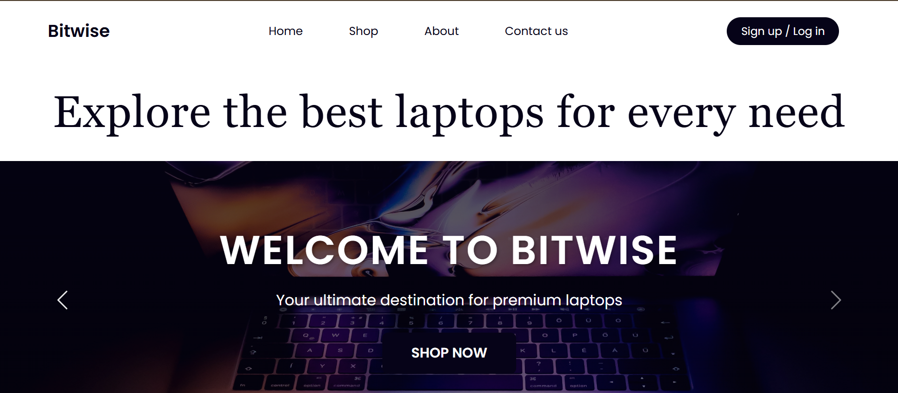
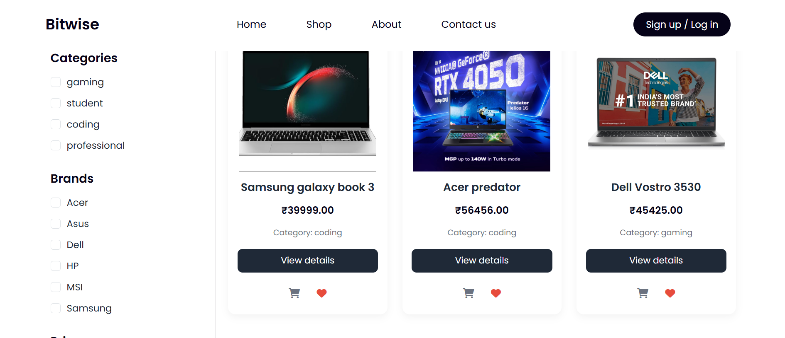
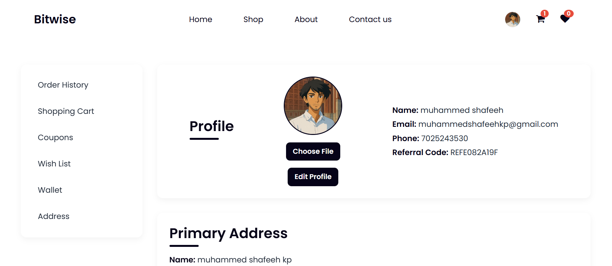

# 🛒 Bitwise Ecommerce

A full-stack e-commerce platform for laptops and accessories, built from scratch with modern technologies.  
Bitwise offers a seamless shopping experience for customers and powerful management tools for administrators.

---

## 🚀 Live Demo
[Visit Bitwise Ecommerce](https://bitwise.shafeeh.shop)

---

## ✨ Features

### **User Side**
- User authentication (sign up, login, logout) - Integrated Google Authentication
- Profile management (edit profile, change avatar, update address)
- Product browsing, price , date and name sorting and category & brand filtering 
- Shopping cart & wishlist
- Wallet system for transactions
- Coupons & discounts
- Order history and tracking
- Secure payments via **Razorpay**

### **Admin Side**
- **Wallet Management** – track and manage user wallet transactions
- **User Management** – activate/deactivate accounts, view user details
- **Product Management** – add, update, and delete products with images
- **Order Management** – view and manage orders
- Sales analytics with interactive graphs
- Inventory management

---

## 🛠 Tech Stack

**Frontend:** EJS, Bootstrap, Tailwind CSS  
**Backend:** Node.js, Express.js  
**Database:** MongoDB  
**Caching:** Redis  
**Payment Gateway:** Razorpay  
**Hosting:** AWS EC2  

---

## 📸 Screenshots

### Homepage


### Product Listing


### User Profile


---

## ⚙️ Installation

```bash
# Clone the repository
git clone https://github.com/sha-fee-h/bitwise-ecommerce.git

# Navigate into the folder
cd bitwise-ecommerce

# Install dependencies
npm install

# Create a .env file and add the required environment variables:
# MONGO_URI=...
# REDIS_URI=...
# RAZORPAY_KEY_ID=...
# RAZORPAY_KEY_SECRET=...
# SESSION_SECRET=...

# Start the server
npm start
